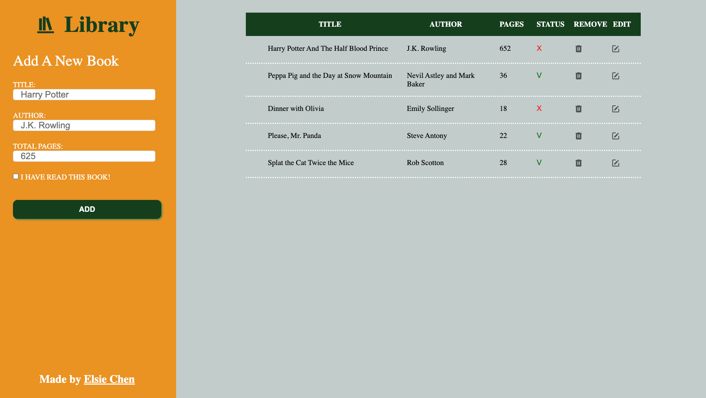

# Project: Library
This is a simple library app created with HTML, CSS, and JavaScript. It allows users to create, read, update, and delete book items to track user's book reading status.

## Table of Contents
- Demo
- Technologies Used
- Features
- Credits

## Demo
Check out the [**live**](https://elsiechen.github.io/project-library/) demo.

## Technologies Used
- HTML
- CSS
- JavaScript

## Features
- Dynamic creating book items using JavaScript on the same page with form inputs
- Single form for creating and editing book items
- Toggle buttons to change status of book reading
- Use CSS layout module Flexbox and Grid to create web design
- Built-in form validation for inputs
- Clear input hints to improve user experience
- Styling form to show invalid inputs from valid ones to help user finish the form
- Use CSS custom property to set a few theme colors instead of having to update every single instance of a specific value
## Credits
- The Odin Project: [Project: Library](https://www.theodinproject.com/lessons/node-path-javascript-library)

